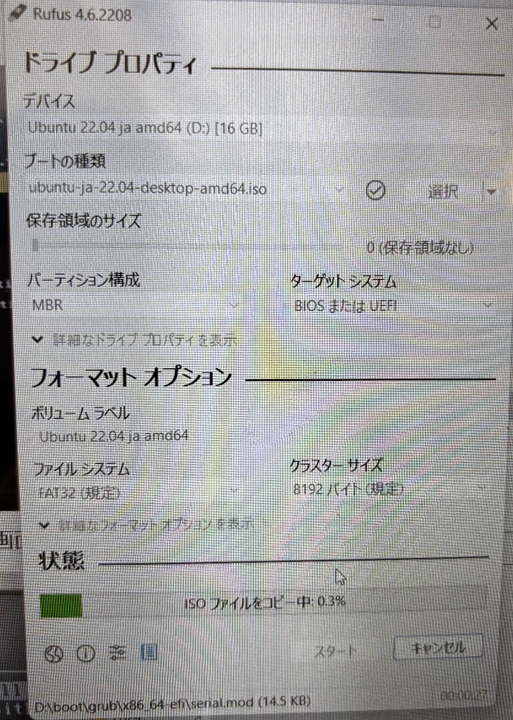
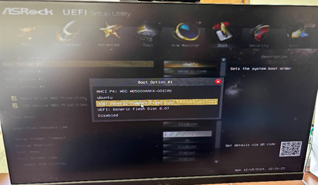
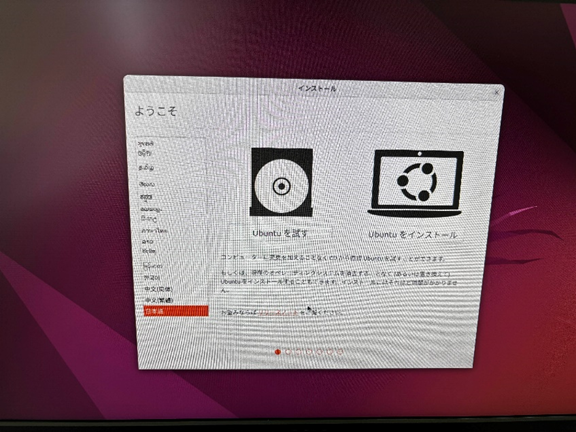
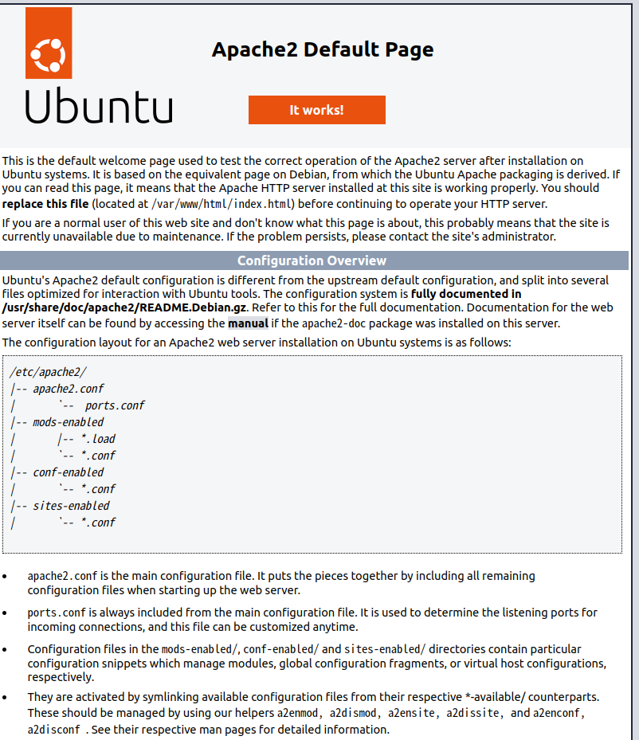

# PCにUbuntuを導入してApache2でウェブサーバを構築するまで
## 前書き
この文書ではOSが入っていないPCにLinuxのディストリビューションであるUbuntuを導入し、Apache2を用いてサーバの構築する過程を示すものである。
## 実行環境
- Ubuntu 22.04 LTS
# 本論
## Ubuntuの導入
### Ubuntuのダウンロード
今回は[Ubuntu](https://jp.ubuntu.com/download)の日本語版公式サイトからダウンロードする。

>Ubuntu（ウブントゥ[6]、[ʊˈbʊntuː] ( 音声ファイル); oo-BOON-too[7]）はDebian GNU/Linuxを母体としたオペレーティングシステム（OS）である。Linuxディストリビューションの1つであり、自由ソフトウェアとして提供されている。カノニカルから支援を受けて開発されている。開発目標は「誰にでも使いやすい最新かつ安定したOS」を提供することである。 -[wikipedia](https://ja.wikipedia.org/wiki/Ubuntu)より引用

### Rufusのダウンロード
[Rufus](https://rufus.ie/ja/)の公式サイトからダウンロードする。窓の杜からでも構わない。
#### Chat GPTに聞いてみよう：Ubuntuを導入するのになぜrufusを用いるのか？

>Rufusを使う理由は、Windows環境でUbuntuのインストール用USBを簡単かつ確実に作成できるからです。以下に理由を簡単に説明します：  
初心者に優しい操作性
Rufusはシンプルで直感的なインターフェースを持っており、数クリックでインストール用USBを作成できます。  
高い互換性  
・UbuntuのISOファイルに対応しており、BIOSやUEFIモードどちらでも動作するUSBを作成可能。  
早い書き込み速度  
・Rufusは他のツールに比べてUSBへの書き込みが高速。  
軽量でインストール不要  
・Rufusは小さいサイズで、ダウンロード後すぐに使えます（ポータブル版もあり）。  
エラーを自動的に処理  
・書き込み中のエラーや互換性の問題を最小限に抑えてくれるため、失敗が少ない。 - [ChatGPT-4o](https://chatgpt.com/share/67a04a32-0c3c-8003-bc75-34e1f00993de)

### Bootable USBの作成
適当なUSBを挿し、Rufusを起動すると以下のようなウィンドウが出現する。


"ブートの種類"から"ubuntu-ja-22.04-desktop-amd64.iso"を選択しスタートさせる。数分待った後、完了する。
### Ubuntuを導入する
Ubuntuを入れるPCにUSBを挿してBIOSを起動する。
Boot→起動の順番からUSBを一番最初にする。

Exitして再起動しTry or Install Ubuntuの選択でUbuntuのインストールは完了する。
### 初期設定
Ubuntuが起動すると「Ubuntuを試す」・「Ubuntuをインストールする」というタブが現れるので「Ubuntuをインストールする」を選択する。
  
キーボードレイアウトとタイムゾーンを設定しログインIDとパスワードを作成するとUbuntuが利用できるようになる。
### 日本語化入力に対応させる
現時点ではUbuntuでは日本語を入力することができない。なので今回は[Mozc](https://github.com/google/mozc)を導入する。
```:Mozcの導入
$ sudo apt -y install ibus-mozc
```
### Google Chromeをインストールする
Ubuntuには最初からブラウザとして狐が入っているが、Google Chromeの同期を使うためにGoogle Chromeを導入した。
```
#取得
$ wget https://dl.google.com/linux/direct/google-chrome-stable_current_amd64.deb
#インストール
$ sudo apt install ./google-chrome-stable_current_amd64.deb
```
## Apache
Webサーバを構築する手段の一つとしてApacheがあげられる。
### Apacheのインストール
```
#Apacheのインストール
$sudo apt -y install apache2
#Apacheの起動
$sudo systemctl start apache2
#自動起動を有効化
$sudo systemctl enable apache2
#ステータスを表示する
$sudo systemctl status apache2
```
ブラウザからhttps://localhostとするとApacheのウェルカムページが表示される。

### 仮想ホストの設定
Apacheの設定ファイルはサーバ全体に適応される「/etc/apache2/apache2.conf」と
デフォルトでアクセスされる仮想ホストに適用するための「/etc/apache2/sites-available/000-default.conf」で管理される。
後者が初期の仮想ホストとして設定されている。これを残したまま他の仮想ホストを作成するときは「/etc/apache2/sites-available」直下に新しい設定ファイルを作成する。今回は000-default.confをコピーする。
```
$sudo cp /etc/apache2/sites-available/000-default.conf /etc/apache2/sites-available/test.conf
```
test.confに以下の内容を記述する。
```
<VirtualHost *:80>
    ServerAdmin webmaster@localhost
    DocumentRoot /index
    DirectoryIndex index.html
    ErrorLog ${APACHE_LOG_DIR}/error.log
    CustomLog ${APACHE_LOG_DIR}/access.log combined
</VirtualHost>
```
次にグローバル設定ファイル(/etc/apache2/apache2.conf)を編集する
```
<Directry /index>
    Options Indexes FollowSymLinks
    AllowOverride None
    Require all granted
</Directry>
```
```
#ディレクトリやファイルを作成する。
$sudo mkdir /index
$sudo touch /index/index.html
#index.htmlに適当なhtmlを入れる。
$sudo vi /index/index.html
```
適当にHello Worldでも散らしておく。
```html:index.html
<html>
    <body>
        <p>Hello, World!</p>
    </body>
</html>
```
```
#デフォルトの仮想ホストを切断
$sudo a2dissite 000-defaule.conf
#設定を反映させるためリロード
$sudo systemctl reload apache2
#仮想ホストをサーバに反映
sudo systemctl reload apache2
```
これでhttp://localhostとすればウェルカムページでなく、作成したhtml（今回だとHello, World!）が確認できるであろう。
### ファイアーウォールの設定
Ubuntuでは、ファイアウォールの設定に`ufw`コマンドを利用する。構築したWebサーバへのアクセスを許可するには以下のコマンドを実行する。
```
# ファイアウォールを有効化する
$ sudo ufw enable 
# 80番ポートを開放する
$ sudo ufw allow ‘Apache’ 
$ sudo ufw status
Status: active

To Action From
-- ------ ----
Apache ALLOW Anywhere
Apache (v6) ALLOW Anywhere (v6)
```
正常に実行されていれば、ステータスが上記のように得られる。
# 参考文献（リンク避けしています）
- ttps://jp.ubuntu.com/download
- ttps://rufus.ie/ja/
- ttps://www.gigafree.net/system/os/Rufus.html
- ttps://blog.kabocy.com/linux/5806/
- ttps://github.com/google/mozc
- ttps://www.google.com/chrome/
- ttps://github.com/r12357/linux_sever_intro_doc/blob/main/linux_guide.pdf
- ttps://ja.wikipedia.org/wiki/Ubuntu
- ttps://chatgpt.com
- ttps://qiita.com/pyon_kiti_jp/items/7000b9a04aa2899bf9a8
- ttps://gagaga898989.github.io/WebCreate-procedure/

# 備忘録的な
## 基本コマンドの比較：Linux vs Windows
### ファイル/ディレクトリ操作

| 操作                  | Linux (Bash)         | Windows (CMD/PowerShell)    |
|-----------------------|----------------------|-----------------------------|
| 現在のディレクトリ確認 | `pwd`               | `cd` または `Get-Location` |
| ファイル一覧表示       | `ls`               | `dir`                       |
| ディレクトリ変更       | `cd [ディレクトリ名]`| `cd [ディレクトリ名]`        |
| ファイル削除           | `rm [ファイル名]`   | `del [ファイル名]`          |
| ディレクトリ削除       | `rm -r [ディレクトリ名]` | `rmdir /s [ディレクトリ名]` |
| ファイル移動/名前変更  | `mv [元] [先]`      | `move [元] [先]`            |
| ファイルコピー         | `cp [元] [先]`      | `copy [元] [先]`            |
| ディレクトリ作成       | `mkdir [名前]`      | `mkdir [名前]`              |

### システム操作

| 操作                  | Linux (Bash)         | Windows (CMD/PowerShell)    |
|-----------------------|----------------------|-----------------------------|
| IPアドレス確認         | `ifconfig` または `ip a` | `ipconfig`                  |
| プロセス確認           | `ps`                | `tasklist`                  |
| プロセス終了           | `kill [PID]`        | `taskkill /PID [PID]`       |
| 再起動                 | `sudo reboot`       | `shutdown /r`               |
| シャットダウン         | `sudo shutdown now` | `shutdown /s`               |

### テキスト操作

| 操作                  | Linux (Bash)         | Windows (CMD/PowerShell)    |
|-----------------------|----------------------|-----------------------------|
| ファイル内容表示       | `cat [ファイル名]`   | `type [ファイル名]`         |
| ファイル編集           | `nano [ファイル名]`  | `notepad [ファイル名]`      |
| 検索                  | `grep [文字列] [ファイル]` | `findstr [文字列] [ファイル]` |
| ファイル比較           | `diff [ファイル1] [ファイル2]` | `fc [ファイル1] [ファイル2]` |

### その他便利なコマンド

| 操作                  | Linux (Bash)         | Windows (CMD/PowerShell)    |
|-----------------------|----------------------|-----------------------------|
| 環境変数確認           | `echo $VARIABLE`    | `echo %VARIABLE%`           |
| 履歴確認               | `history`           | `doskey /history` (PowerShellでは履歴はない) |
| ディスク使用状況確認   | `df -h`             | `wmic logicaldisk get size,freespace,caption` |
| クリア                 | `clear`             | `cls`                       |

## Vimの基本操作ガイド

### Vimの起動と終了

| 操作                     | コマンド                        | 説明                                         |
|--------------------------|--------------------------------|--------------------------------------------|
| Vimの起動                 | `vim [ファイル名]`             | ファイルを開く（新規作成も可能）           |
| Vimの終了（保存あり）     | `:wq`                         | ファイルを保存して終了                     |
| Vimの終了（保存なし）     | `:q!`                         | 保存せずに強制終了                         |
| ファイルを保存            | `:w`                          | 現在の内容を保存                           |
| 別名で保存                | `:w [新しいファイル名]`        | 内容を別名で保存                           |

---

### モードの切り替え

| モード                     | コマンド                        | 説明                                         |
|---------------------------|--------------------------------|--------------------------------------------|
| ノーマルモード（通常モード）| 【デフォルト】 Esc キーで戻る  | コマンド入力や操作を行う基本モード         |
| 挿入モード（編集モード）    | `i`                           | カーソルの左側に文字を挿入                 |
| 挿入モード（末尾に挿入）    | `a`                           | カーソルの右側に文字を挿入                 |
| コマンドラインモード         | `:`                           | 保存・終了・検索などのコマンドを入力する   |
| ビジュアルモード            | `v`                           | 選択範囲を作成                             |

---

### 基本操作（ノーマルモード）

| 操作                     | コマンド                        | 説明                                         |
|--------------------------|--------------------------------|--------------------------------------------|
| カーソルを移動（矢印キー）| `h` (左), `j` (下), `k` (上), `l` (右) | 矢印キーの代わりに使用                     |
| 行頭に移動                | `0` または `^`                 | 行の先頭に移動                             |
| 行末に移動                | `$`                           | 行の末尾に移動                             |
| 次の単語に移動            | `w`                           | 次の単語の先頭に移動                       |
| 前の単語に移動            | `b`                           | 前の単語の先頭に移動                       |
| ページアップ/ダウン       | `Ctrl + u` (上), `Ctrl + d` (下) | 画面単位でスクロール                       |

---

### 編集操作

| 操作                     | コマンド                        | 説明                                         |
|--------------------------|--------------------------------|--------------------------------------------|
| 一文字削除               | `x`                           | カーソル上の文字を削除                     |
| 一行削除                 | `dd`                          | カーソルの行を削除                         |
| コピー                   | `yy`                          | カーソルの行をコピー                       |
| 貼り付け                 | `p`                           | コピーまたは削除した内容を貼り付け         |
| 検索                     | `/[検索文字列]`               | 指定した文字列を検索                       |
| 置換                     | `:%s/旧文字列/新文字列/g`      | ファイル全体の文字列を置換                 |

---

### ビジュアルモード操作

| 操作                     | コマンド                        | 説明                                         |
|--------------------------|--------------------------------|--------------------------------------------|
| 選択開始                 | `v`                           | 一文字単位で選択開始                       |
| 行単位選択               | `V`                           | 行単位で選択開始                           |
| 選択範囲をコピー         | `y`                           | 選択範囲をコピー                           |
| 選択範囲を削除           | `d`                           | 選択範囲を削除                             |
| 選択範囲をインデント      | `>` (インデント), `<` (逆インデント) | 選択範囲をインデント調整                   |

---

### 応用操作

| 操作                     | コマンド                        | 説明                                         |
|--------------------------|--------------------------------|--------------------------------------------|
| Undo（操作を元に戻す）    | `u`                           | 直前の操作を取り消す                       |
| Redo（操作をやり直す）    | `Ctrl + r`                    | Undoした操作をやり直す                     |
| 行番号表示               | `:set number`                 | 左側に行番号を表示                         |
| 行番号非表示             | `:set nonumber`               | 行番号を非表示                             |
| 複数ファイルを開く       | `vim [ファイル1] [ファイル2]`  | 同時に複数ファイルを開く                   |
| ファイル間の切り替え     | `:n` (次へ), `:prev` (前へ)   | 開いているファイルを切り替える             |

---

## 基本的なポイント
- **ノーマルモードを中心に操作**：最初はノーマルモードの基本操作に慣れることが重要。
- **ショートカットを覚える**：頻繁に使うコマンド（保存、終了、移動など）を覚えると効率が上がる。
- **困ったら`:help`**：Vim内で`:help`を使うと詳細な情報が確認可能。

## Markdown チートシート
### 見出し（Headings）
```markdown
# 見出し1
## 見出し2
### 見出し3
#### 見出し4
##### 見出し5
###### 見出し6
```
# 見出し1  
## 見出し2  
### 見出し3  
#### 見出し4
##### 見出し5
###### 見出し6
---

### 強調（Emphasis）
```markdown
*斜体* または _斜体_  
**太字** または __太字__  
***斜体かつ太字***  
~~取り消し線~~
```
*斜体*  
**太字**  
***斜体かつ太字***  
~~取り消し線~~

---

### リスト（Lists）

#### 順序なしリスト（Unordered List）
```markdown
- アイテム1
  - サブアイテム1
  - サブアイテム2
- アイテム2
```
- アイテム1  
  - サブアイテム1  
  - サブアイテム2  
- アイテム2  

#### 順序付きリスト（Ordered List）
```markdown
1. アイテム1
2. アイテム2
   1. サブアイテム1
   2. サブアイテム2
```
1. アイテム1  
2. アイテム2  
   1. サブアイテム1  
   2. サブアイテム2  

---

### リンクと画像（Links and Images）

#### リンク（Links）
```markdown
[リンクテキスト](https://example.com)
```
[リンクテキスト](https://example.com)

#### 画像（Images）
```markdown

```


---

### コードブロック（Code Blocks）

#### インラインコード（Inline Code）
```markdown
`インラインコード`
```
`インラインコード`

#### ブロックコード（Code Block）
\`\`\`言語名  
コード内容  
\`\`\`
```markdown
\`\`\`python
def hello():
    print("Hello, World!")
\`\`\`
```
```python
def hello():
    print("Hello, World!")
```

---

### 引用（Blockquote）
```markdown
> 引用文
>> ネストされた引用
```
> 引用文  
>> ネストされた引用  

---

### テーブル（Tables）
```markdown
| 見出し1 | 見出し2 | 見出し3 |
|---------|---------|---------|
| 内容1   | 内容2   | 内容3   |
| 内容4   | 内容5   | 内容6   |
```
| 見出し1 | 見出し2 | 見出し3 |
|---------|---------|---------|
| 内容1   | 内容2   | 内容3   |
| 内容4   | 内容5   | 内容6   |

---

### 水平線（Horizontal Rule）
```markdown
---
***
___
```
---
***
___

---

### 特殊文字のエスケープ（Escape Characters）
Markdown記法として解釈される文字を無効化したい場合は、`\`を使います。
```markdown
\*斜体ではない\*
```
\*斜体ではない\*

---

### チェックボックス（Checkboxes, GitHubのみ対応）
```markdown
- [x] 完了したタスク
- [ ] 未完了のタスク
```
- [x] 完了したタスク  
- [ ] 未完了のタスク  

---

### その他便利な記法

#### 脚注（Footnotes）
```markdown
これは脚注の例です。[^1]

[^1]: ここに脚注の内容を書く
```
これは脚注の例です。[^1]  

[^1]: ここに脚注の内容を書く  

#### 自動リンク（Autolink）
```markdown
<https://example.com>
```
<https://example.com>

---

### *備忘録の作成にChat gpt4oを使用しているため、動作をそれぞれ確認したが万が一のハルシネーションの漏れがある場合があることに留意する。